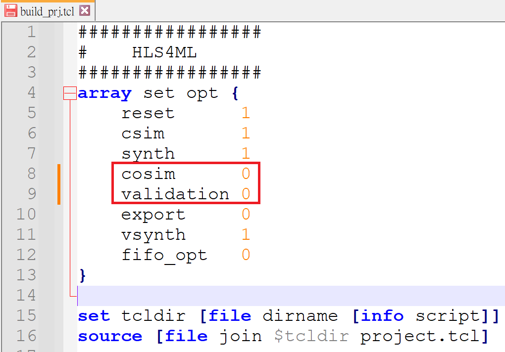
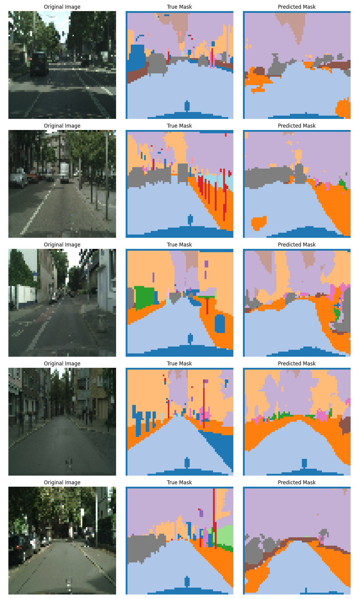

## 🏁 Final Round

---

## 🏆 Evaluation Criteria

Submissions will be evaluated based on **semantic accuracy**, **latency**, and compliance with **FPGA resource constraints**. The final score is determined using the following rules:

### Scoring Rule
All four resources reported by `vynth` must be ≤ 75% of the target FPGA's capacity — identical to the requirement in the [qualifying round](https://github.com/nycu-pcs-lab/FPGA_Challenge2025_Qualifying_Round_Challenge).
- Target FPGA: Alveo U55C

- If **FPS ≥ 60**:  
  **Score = mIoU**

- If **FPS < 60**:  
  **Score = mIoU × (FPS / 60)**
  
This scoring strategy prioritizes real-time performance (≥ 60 FPS), then rewards improved segmentation accuracy. Submissions below 60 FPS will be proportionally penalized.
### Definitions
- **mIoU**: Mean Intersection over Union, a measure of semantic segmentation accuracy.  
- **FPS**: Frames Per Second, calculated as `1 / latency`  
  - Latency = Max Latency from `csynth` Report different from the requirement in the [qualifying round](https://github.com/nycu-pcs-lab/FPGA_Challenge2025_Qualifying_Round_Challenge), as the cosim takes a lot of time to finish.
  - The csynth report is at `myproject_prj/solution1/syn/report/myproject_csynth.rpt`
  - Remember to set both the cosim FLAG and validation FPGA to 0 to skip the RTL simulation.
  

  

  

---

## 📂 Dataset Introduction

Cityscapes is a popular benchmark dataset for semantic segmentation in autonomous driving applications.

- **Training set**: 2,975 images  
- **Validation set**: 500 images  
- The **validation set** is used for performance evaluation.  
- Each image is annotated with **20 semantic classes** (e.g., building, road, car, pedestrian, etc.)

To accommodate FPGA limitations, **testing images are resized to 64×64**. However, we provide training images at multiple resolutions (2×, 4×) and **encourage participants to leverage these high-resolution variants to enhance model performance**.

---

## Accuracy Scoring System & Dataset

- The dataset and evaluation system are hosted on the [Kaggle Competition Page](https://www.kaggle.com/t/195ff157a94e42448487db92f612b4ff), same as the setup used in the [qualifying round](https://github.com/nycu-pcs-lab/FPGA_Challenge2025_Qualifying_Round_Challenge)
- You can import and run the [Jupyter notebook](https://github.com/nycu-pcs-lab/FPGA_Challenge2025_Final_Round_Challenge/blob/main/cityscape_qkeras_hls4ml_endtoend.ipynb) on Kaggle to see an end-to-end workflow example.

